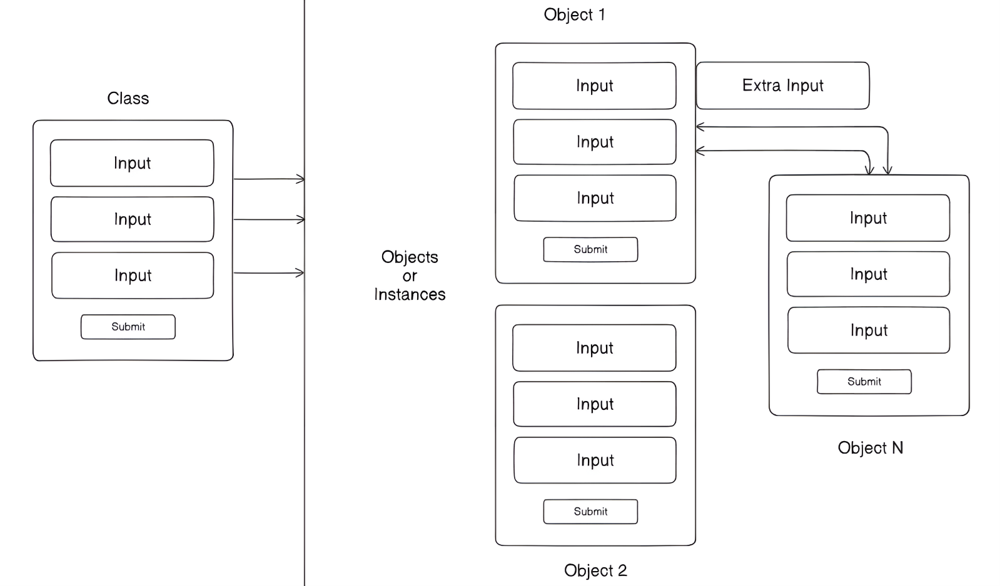

# Object-Oriented Programming in JavaScript

## OOPs and Prototype-Based Programming


### Class
- A **class** is a template or blueprint that defines **data members** (attributes) and **member functions** (methods).
- It doesn’t hold the data itself but serves as a structure for creating objects.

### Objects / Instances
- Multiple **objects** are created from the class, each having the same structure.
- Each object is a unique instance of the class and can also have **additional attributes** individually.

### Modification in an Instance
- An instance (e.g., `object1`) can be modified separately.
- This shows that **JavaScript objects are flexible** — changes to one instance won’t affect the class definition.

---

## Prototype-Based Programming

- In JavaScript, **almost everything has a prototype** when dealing with objects.
- A **prototype** is like a built-in template that provides extra properties or methods to objects, arrays, functions, etc.
- JavaScript is **not a classical OOP language** like Java or C++, but it still supports OOP concepts like inheritance and object creation.

### Prototype Real life Example
> If you make a cake (object), it follows a recipe (prototype).  
> If you add a new feature (like berries), you update the recipe (prototype), and all future cakes can have berries.

---

## Constructors in JavaScript

Constructors are used to **create and initialize objects**. JavaScript supports two types:

### 1. Function-Based Constructor (ES5)

> Older way of creating constructor functions before ES6.

```js
function makeHuman(name, age) { //Function based class
  this.name = name; //Properties, this. assign values
  this.age = age;
}

let ans = new makeHuman("Suraj", 19); //Creates a new blank object
console.log(ans);
```
- `new` keyword creates a blank object.
- `this` assigns values to that blank object.
- This approach mimics class-like behavior.

## 2. Class-Based Constructor (ES6+)
>Introduced in ES6 — modern way to create reusable and clean object structures.
```js
class person {   //class
  constructor(nickname,surname) { //constructor with 2 parameters
    this.nickname = nickname; //attributes
    this.surname = surname;
  }
  method() { //method
    return `This is a method ${this.nickname} and ${this.surname}`;
  }
}
let calling = new person("suraj", 'verma');
console.log(calling.method()) //calling the method
```

- `class` is a blueprint of code which is used to create multiple `objects`
- Helps organize code and supports object-oriented design.
- Use the constructor() method to initialize or assign parameters (properties) to objects when creating them using the new keyword.

### Some important questions

#### 1. Do we always need classes + constructors to create objects?
- No, For simple use cases:
```js
const user = {
  name: "Vimal",
  age: 20
};
```

- Yes, For professional & scalable Development
    - Create multiple reusable objects
    - Keep code clean, scalable, and organized
```js
class User {
  constructor(name, age) {
    this.name = name;
    this.age = age;
  }
}
```

#### 2. How `new` and `this` work together?
```js
function User(name, age) {
  this.name = name; //Assigning
  this.age = age;
}

let person = new User("Vimal", 20); // Creating new object
```
- `new` creates an **empty** object in memory
- `this` assigns values to that object
- Both are required
    - Without `new`: `this` has no object
    - Without `this`: the blank object remains empty

> **Note**
>
> Example:
> ```js
> class Person {
>   constructor(name, age) {
>     this.name = name;
>     this.age = age;
>     this.describe = (place) => { //parameter of describe method
>     return `My name is ${this.name} and my age is ${this.age}, I'm from ${place}`;
>     };
>   }
> }
> let person1 = new Person("Vimal", 19);
> console.log(person1.describe("Delhi"));
>
> let person2 = new Person("Suraj", 19.5);
> console.log(person2.describe("Brijpuri"));
>```
> - `place` is a parameter of the `describe()` method, not of the constructor, so we don't write `this.place`

---

# Principles of OOPs

## 1. Inheritance 

Inheritance is a core concept of Object-Oriented Programming that allows one class or function to **acquire the properties** and **methods** of another. In JavaScript, inheritance can be implemented in two main ways:

### 1. Prototype-Based Inheritance (Before ES6)

JavaScript was originally built on **prototypes**, not classical classes like Java or C++. In this method:
- Functions act like classes.
- We use the `.prototype` property to attach methods that all instances/objects can access.

### Example:

```js
function makeHuman(name, age) {
  this.name = name;
  this.age = age;
}

// Adding a **method** to the prototype
makeHuman.prototype.printMyName = function () {
  console.log(this.name);
  console.log(this.age);
};

const human1 = new makeHuman("Vimal", 19);
const human2 = new makeHuman("Suraj", 19);

human1.printMyName();
human2.printMyName();
```

### 2. Class-Based Inheritance (ES6 and Modern JavaScript)
ES6 introduced the `class` syntax, making inheritance more readable and closer to traditional OOP languages.
- Use the `extends` keyword to inherit from a parent class.

### Example without `super()`
```js
// Parent class
class Animal {
  constructor(name) { //Parent class's constructor
    this.name = name;
  }
  sound() {
    console.log(`${this.name} makes a sound.`);
  }
}

// Child class
class Dog extends Animal {
  speak() { // Child class's method
    console.log(`${this.name} barks.`);
  }
}

const dog = new Dog("Buddy");
dog.sound(); // Output: Buddy makes a sound.
dog.speak(); // Output: Buddy barks.
```

### Example with `super()`
- To access and pass **arguments** to the parent class's constructor, we must use `super()` inside the child class's constructor.

```js
//Parent class
class Animal {
  constructor(name) { //Parent class's constructor
    this.name = name;
  }
}
//Child class
class Dog extends Animal {
  constructor(name, breed) { //Child classn's constructor
    super(name); // MUST call parent constructor first
    this.breed = breed;
  }
  speak() {
    console.log(`${this.name}, the ${this.breed}, barks.`);
  }
}

const dog = new Dog("Buddy", "Labrador");
dog.speak(); // Output: Buddy, the Labrador, barks.
```

---

## 2. Encapsulation

### What is Encapsulation?

- Wrapping data (attributes) and methods (functions) into a single unit called a **`class`**.
- It also means hiding some parts of the data so they can’t be changed directly from outside the class.

> 💊 Think of it like a medicine capsule — the ingredients are safely packed inside. Only specific instructions (methods) can access or change them.

### Private Properties

In modern JavaScript (ES2020+), we can declare **private fields** by adding **before variable** names with `#`.

```js
class BankAccount {
  #balance = 0; // Private data member

  deposit(amount) {
    this.#balance += amount; // Update private property
    return this.#balance;
  }

  getBalance() { // Method can be accessed by outside, but cant access #balance
    return `$ ${this.#balance}`; // Return current balance
  }
}
const account = new BankAccount();
account.deposit(100);
console.log(account.getBalance()); // $100
```
> console.log(account.#balance); <br>
> // SyntaxError: Private field '#balance' must be declared in an enclosing class

### Getters and Setters
Getters and setters allow **controlled access** to private or protected data. They are used to read or modify properties safely, often including validation or additional logic.

**Example**
```js
class BankAccount {
  constructor(balance = 0) {
    this._balance = balance; // Convention: underscore means 'private'
  }

  // Getter to read the balance
  get balance() {
    return this._balance;
  }

  // Setter to update the balance safely
  set balance(amount) {
    if (amount < 0) {
      throw new Error("Balance cannot be negative");
    }
    this._balance = amount;
  }

  deposit(amount) {
    if (amount > 0) {
      this._balance += amount;
    }
  }

  withdraw(amount) {
    if (amount > this._balance) {
      throw new Error("Insufficient funds");
    }
    this._balance -= amount;
  }
}

const account = new BankAccount(100);
account.deposit(50);
console.log(account.balance); // 150
account.balance = 200; // Uses setter
console.log(account.balance); // 200
// account.balance = -50; // Throws Error: Balance cannot be negative
```
> **Note: <br>
>
> `_` vs `#` for Private Variables in JavaScript**
> - `_variable` (underscore) is **only a naming convention** to indicate that the property should be treated as private, but it is still accessible from outside the class.
> - `#variable` (hash) is **true private field syntax introduced in ES2020**, which enforces privacy by the language itself — these fields **cannot be accessed or modified from outside the class**.
> - Trying to access a `#` private field from outside the class will result in a **syntax error**.
> - Using `_` does not prevent access, it relies on developer discipline, while `#` guarantees enforced privacy.
> - `#` private fields have **better encapsulation** but require modern JavaScript support (ES2020+).
> - Choose `_` if you want compatibility and simplicity but no strict privacy; choose `#` for real privacy and encapsulation.

---

## 3. Abstraction

### What is Abstraction?
- Abstraction means **hiding the complex** or **unnecessary details** and only showing the useful parts of something.
- It also means **hiding some parts** of the data so they can’t be **changed directly** from outside the class.
- By using `#` before a variable inside a class, we make it **private** (hidden from outside).

### Real life Example
Think of a car:
- We use a **key** to start the engine.
- We don’t need to understand **how** the engine, battery, or fuel system work — it’s hidden.
- We just use the interface (steering, pedals, etc.).

```js
class BankAccount {
  #balance = 0; // Encapsulation

  deposit(amount) {
    this.#balance += amount; // Abstraction -> Hiding the process 
  }

  getBalance() {
    return `$${this.#balance}`;
  }
}
```

> **Note**
> - **Encapsulation** = Hiding **data** (like a capsule 💊)  
> - **Abstraction** = Hiding **complexity** (like ATM interface 🏧)
